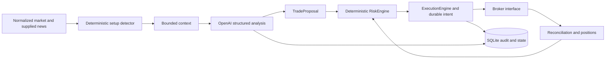

# Architecture

The development assistant is not part of this diagram or runtime. The registry
contains only application-local `wayland:*` analytical role IDs. No CLI agent
scanner, conversation import, Tyrell database connection or cross-app handoff is
implemented. A logical role does not imply one paid model call per quote.

## Persistence and ownership

The application journal uses SQLite WAL, `synchronous=FULL`, explicit transactions
and a versioned schema (`user_version=1`). A process-level file lock permits one
execution owner for a given journal. Inspection and kill activation can use separate
connections. Use one configured Wayland state root/client ID per broker account;
separate roots cannot coordinate ownership and are not a supported deployment.
The broker simulator stores its authority separately, so losing the application
process does not erase simulated orders or positions.

Proposal IDs are unique in the intent table. A deterministic UUID derived from
account and proposal ID provides a stable `intent_id`. This is correlation, not a
claim that IBKR deduplicates requests. Broker IDs and fill execution IDs are
recorded and checked independently.

## Submission and recovery

1. Start in RECONCILING and obtain fresh, complete broker state.
2. Verify account/mode, order correlation, fill quantities and actual positions.
3. Independently evaluate the proposal against current risk inputs.
4. Atomically persist PREPARED intent plus audit event.
5. Persist SUBMITTING **before** calling the broker.
6. Persist acknowledgement or UNKNOWN. Never automatically retry a submission.

A recovered PREPARED intent without a broker order is aborted: the code invariant
proves no broker call was made. A SUBMITTING/UNKNOWN intent without authoritative
broker evidence stays unresolved and blocks entries. A timeout is not a rejection.
Even absence from an open-order list is insufficient: the order could already have
filled or been cancelled. Missing historical order/fill evidence therefore fails
closed. No CLI command exists to blindly mark an uncertain intent safe.

The current reconciler requires complete correlated order/fill history. The fake
retains that history; IBKR's recent execution window does not satisfy this
contract. This is why the real adapter reports `complete=False` and cannot route
orders yet. Before enabling IBKR paper execution, implement durable incremental
execution ingestion, historical coverage verification, account-wide exposure,
combo/assignment representation and calibrated reconciliation rules.

## Analysis boundary

The provider uses `AsyncOpenAI.responses.parse(..., text_format=TradeProposal)`.
No tools are exposed. Input is an explicit bounded context, not environment or
broker objects. SDK retries are disabled; timeout/refusal/malformed response means
no entry. The exact supplied context, prompt/schema version, requested model,
reported model, response ID/text, validated proposal and risk decision are audited.
A model alias is not an immutable version guarantee or reproducibility promise.

The execution engine re-evaluates risk after analysis; model time cannot extend a
quote's validity. Initial implementation rejects stale proposals instead of
refreshing their prices silently. A fresh-context/reproposal policy is needed for
slow model calls before connecting a continuous data feed.

## Operational states

PAPER/LIVE is independent of RECONCILING/READY/DEGRADED/SAFE. A successful broker
reconciliation can restore READY only when kill is off and analysis health is
known good. Analysis failures set DEGRADED. Broker uncertainty sets SAFE and blocks
both entries and unverified exits. Kill permits only separately validated risk
reduction of verified exposure. Shutdown prevents new submission and preserves
unresolved state.

Sources: [OpenAI Structured Outputs](https://developers.openai.com/api/docs/guides/structured-outputs),
[IBKR open orders](https://interactivebrokers.github.io/tws-api/open_orders.html),
[IBKR order reference](https://www.interactivebrokers.com/docs/tws-api/ref/order),
[ib_async API](https://ib-api-reloaded.github.io/ib_async/api.html).
